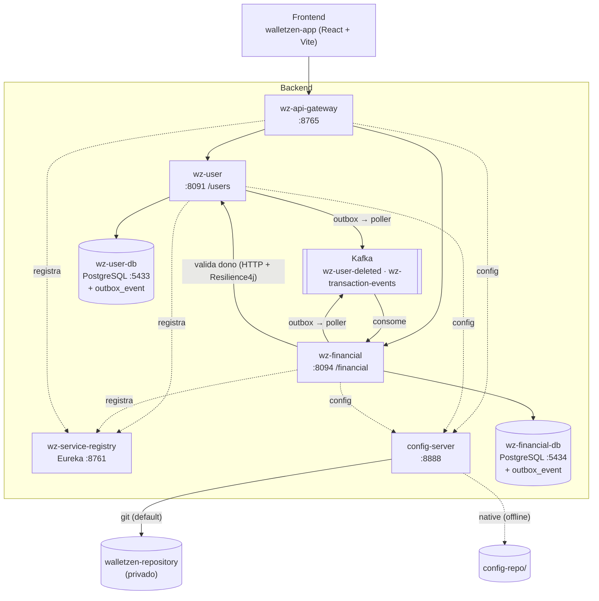

# WalletZen — Backend

Backend da aplicação **WalletZen** (gestão de finanças pessoais), construído como
estudo de arquitetura de microsserviços com Spring Cloud.

O usuário cadastra pessoas (`wz-user`) e lança transações financeiras de
receita/despesa para cada pessoa (`wz-financial`). Os dois serviços conversam de
forma assíncrona por Kafka: ao excluir um usuário, suas transações são desativadas
automaticamente.

> **Status:** projeto de estudo, sem release. Autenticação/autorização via **Keycloak**
> (OAuth2/OIDC) — ver [Segurança](#segurança). O schema dos bancos é versionado com Flyway
> (`ddl-auto: validate`) e os dados persistem entre restarts. O frontend fica no
> repositório [`walletzen-app`](https://github.com/Ismadrade/walletzen-app) e ainda
> não está integrado a estas APIs.

---

## Sumário

- [Arquitetura](#arquitetura)
- [Stack](#stack)
- [Serviços](#serviços)
- [Comunicação assíncrona (Kafka + Outbox)](#comunicação-assíncrona-kafka--outbox)
- [Bancos de dados](#bancos-de-dados)
- [Segurança](#segurança)
- [APIs](#apis)
- [Modelos de dados](#modelos-de-dados)
- [Como rodar localmente](#como-rodar-localmente)
- [Variáveis de ambiente](#variáveis-de-ambiente)
- [Estrutura de pastas](#estrutura-de-pastas)

---

## Arquitetura



Padrões de projeto por serviço:

- **wz-user** — arquitetura hexagonal (ports & adapters): `core` (domínio + casos de
  uso) isolado dos `adapter` de entrada (web) e saída (persistência JPA, Kafka).
- **wz-financial** — arquitetura em camadas tradicional (`controller` → `service` →
  `repository`).

---

## Stack

Java 17 · Spring Boot 3.4.x · Spring Cloud 2024.0.x · Spring Cloud Gateway ·
Netflix Eureka · Spring Cloud Config · Spring Cloud OpenFeign + LoadBalancer ·
Resilience4j · Spring Data JPA · PostgreSQL · Apache Kafka
(`spring-kafka`) · Lombok · MapStruct.

**Build:** Maven wrapper (`config-server`, `wz-api-gateway`, `wz-service-registry`,
`wz-user`) e Gradle wrapper (`wz-financial`).

**Configuração externa:** `wz-user`, `wz-financial` e `wz-api-gateway` consomem o
`config-server` no boot (`spring.config.import: optional:configserver:...`). O
`application.yml` local de cada serviço tem só a identidade (`spring.application.name`) e
o ponteiro para o config-server; datasource, Kafka e Eureka vêm de fora.

O `config-server` tem dois backends, escolhidos por profile:

| Profile | Backend | Origem | Quando usar |
| ------- | ------- | ------ | ----------- |
| `git` (**default**) | Spring Cloud Config + Git | repo privado **`walletzen-repository`** (`search-paths` `wz-user-repo*`, `wz-financial-repo*`, branch `main`) | Sempre. Exige `GIT_USERNAME` e `GIT_PASSWORD` (Personal Access Token com `Contents: read`). |
| `native` | arquivos locais | `config-server/config-repo/` (cópia offline, versionada) | Válvula de escape: sem rede/token. `SPRING_PROFILES_ACTIVE=native`. |

O `config-repo/` local espelha o repositório remoto — mantenha os dois em sincronia ao
alterar config. Nos testes o backend é sempre `native` (`config-server/src/test/resources/application.yml`),
então `./mvnw test` e o CI não precisam de token.

Cada serviço aceita `CONFIG_SERVER_URL` (default `http://localhost:8888`); como o import
é `optional:`, o serviço ainda sobe se o config-server estiver fora do ar (com a config
local/default).

---

## Serviços

| Serviço              | Porta | Context path | Build  | Responsabilidade |
| -------------------- | ----- | ------------ | ------ | ---------------- |
| `wz-service-registry`| 8761  | —            | Maven  | Service discovery (Eureka Server). Não se registra nem busca registro. |
| `config-server`      | 8888  | —            | Maven  | Spring Cloud Config Server. Backend `git` (default, repo privado `walletzen-repository`, exige `GIT_USERNAME`/`GIT_PASSWORD`) ou `native` (`config-repo/`, offline, `SPRING_PROFILES_ACTIVE=native`). Consumido por `wz-user`, `wz-financial` e `wz-api-gateway`. |
| `keycloak`           | 8080  | —            | —      | Identity Provider (OAuth2/OIDC). Realm `walletzen` importado no boot. Ver [Segurança](#segurança). |
| `wz-api-gateway`     | 8765  | —            | Maven  | Spring Cloud Gateway + resource server: barra requisição sem token (`401`) e repassa o `Authorization`. Roteia `/users/**` → `lb://wz-user` e `/financial/**` → `lb://wz-financial`. |
| `wz-user`            | 8091  | `/users`     | Maven  | CRUD de usuários (resource server; `DELETE` exige `ADMIN`). Provisiona o login no Keycloak (`POST` cria, `PUT` sincroniza, `DELETE` desabilita). Publica `UserDeleted` no Kafka. Arquitetura hexagonal. |
| `wz-financial`       | 8094  | `/financial` | Gradle | CRUD de transações (resource server; `GET`/`PUT`/`DELETE` restritos a dono ou `ADMIN`). No `POST`, valida o dono chamando `wz-user` via OpenFeign + Resilience4j. Consome `UserDeleted` e desativa as transações do usuário. |

---

## Comunicação assíncrona (Kafka + Outbox)

### Tópicos

| Tópico | Produtor | Consumidor | Eventos |
| ------ | -------- | ---------- | ------- |
| `wz-user-deleted` | `wz-user` | `wz-financial` | `UserDeleted` |
| `wz-transaction-events` | `wz-financial` | *(Fase 5 — `wz-reports` / notificações)* | `TransactionCreated`, `TransactionUpdated`, `TransactionDeleted` |

Ambos com 3 partições, 1 réplica. Infra local: `obsidiandynamics/kafka` +
**Redpanda Console** em `http://localhost:8081` para inspecionar tópicos.

### Envelope (v1)

Todo evento viaja num envelope versionado (JSON como `String`; sem schema registry):

```jsonc
{ "eventId": "<uuid>", "eventType": "TransactionCreated", "version": 1,
  "occurredAt": "<iso-8601>", "aggregateType": "Transaction",
  "aggregateId": "<uuid>", "data": { /* específico do eventType */ } }
```

`eventId` também vai no header Kafka `event-id`; `eventType` no header `event-type`.
A *key* do registro é o `aggregateId` (ordem por agregado dentro da partição).

### Padrão Outbox (entrega confiável)

`wz-user` e `wz-financial` **não** publicam direto no Kafka. Cada mudança de estado
grava o evento numa tabela `outbox_event` **na mesma transação** do banco — se a
transação commita, o evento existe; se aborta, some. Um relay publica depois:

- **`OutboxPoller`** — `@Scheduled(fixedDelay = 1s)` varre as linhas com
  `published_at IS NULL` (índice parcial) e delega cada uma ao `OutboxDispatcher`,
  que publica no Kafka **numa transação por linha** e marca `published_at`
  (falha ⇒ `attempts++` / `last_error`, tenta de novo na próxima rodada).
- **Gatilho pós-commit** — um `@TransactionalEventListener(AFTER_COMMIT)` acorda o
  poller na hora, sem esperar o `fixedDelay`.
- **Limpeza** — job diário apaga linhas publicadas mais antigas que `outbox.retention` (7d).

Consequência: **Kafka fora do ar não quebra a escrita** — o evento fica na outbox e
é entregue quando o broker volta. A entrega é *at-least-once* (a idempotência no
consumidor chega na Etapa 2 da Fase 4).

Config (`config-repo/{wz-user,wz-financial}.yml`):

```yaml
outbox:
  poll-interval: 1000      # ms (fixedDelay do poller)
  batch-size: 100
  retention: 7d
  purge-cron: "0 0 3 * * *"
```

### `UserDeleted` — consumidor resiliente

`wz-financial` recebe `UserDeleted`, lê `data.userId` do envelope e executa
`UPDATE Transaction SET recordStatus = false WHERE userId = :userId`. A cascata
**não** emite um `TransactionDeleted` por transação (evita tempestade de eventos).

O `UserDeletedConsumer` é `@Transactional` + `@RetryableTopic`:

| Mecanismo | Comportamento |
| --------- | ------------- |
| **Retry topics** (`@RetryableTopic`, `attempts=4`, backoff 1s×2) | erro transitório → a mensagem vai para `wz-user-deleted-retry-0/1/2` (não bloqueia a partição principal); esgotado, vai para `wz-user-deleted-dlt` |
| **Veneno** | `JsonProcessingException` (payload malformado) está em `exclude` → vai **direto** para a `-dlt`, sem reintentar |
| **`@DltHandler`** | loga a mensagem que parou na DLT |
| **Idempotência** | `IdempotencyGuard` grava `(event_id, consumer)` na tabela `processed_event` **na mesma transação** do handler; reentrega (at-least-once) da mesma mensagem → no-op. Rollback do handler desfaz a marca e o retry reprocessa |

O `KafkaConfig` só tem o *producer* (usado pelo poller da Outbox e pelo encaminhamento dos retry topics) — o antigo `DefaultErrorHandler` in-memory saiu.

---

## Comunicação síncrona (HTTP + resiliência)

No `POST /financial/transactions`, antes de gravar, `wz-financial` chama `wz-user`
para validar o **dono** do lançamento (o `userId` já resolvido do token / body).

```
wz-financial ──(OpenFeign + spring-cloud-loadbalancer)──▶ Eureka ("wz-user") ──▶ GET /users/{id}
```

- **Cliente:** `UserClient` (`@FeignClient(name = "wz-user")`), resolvido pelo id no
  Eureka. O Bearer do chamador é repassado (TokenRelay serviço→serviço) por um
  `RequestInterceptor`.
- **`wz-user` faz `GET ... WHERE record_status = true`** → um usuário inexistente
  **ou** inativo devolve `404`. Logo `2xx` = existe e está ativo.
- **Resiliência** (Resilience4j, instância `wz-user`), em `UserValidationGateway`:

  | Padrão | Config | Efeito |
  | ------ | ------ | ------ |
  | `@Retry` | `max-attempts: 3`, `wait: 200ms`, só `FeignException`/`IOException` | reexecuta erro transitório; **não** reintenta `404` |
  | `@CircuitBreaker` | janela 10, mín. 5 chamadas, abre em 50% de falha, `wait-open: 10s`, half-open com 3 provas | quando aberto, curto-circuita direto no fallback |
  | timeout | Feign `connect/read-timeout: 2000ms` | limita cada tentativa |
  | fallback | **fail-closed** | `wz-user` fora do ar ⇒ `503`, lançamento recusado |

- **Respostas:**
  - `userId` inexistente/inativo → **422** `{ "message": "user <id> not found or inactive" }`
  - `wz-user` indisponível / circuito aberto → **503** `{ "message": "user service unavailable, try again later" }`
- **Estado do circuito:** `GET http://localhost:8094/financial/actuator/circuitbreakers`
  (e `.../actuator/health` mostra o componente `circuitBreakers`).
- `PUT`/`DELETE` **não** revalidam — não trocam o dono do lançamento.

Ver o circuito abrir/fechar: `docker compose stop wz-user`, disparar alguns `POST`
válidos (respondem `503` rápido, sem pendurar) → `circuitbreakers` mostra `OPEN`;
`docker compose start wz-user` e aguardar ~15 s → `HALF_OPEN` → `CLOSED`.

---

## Bancos de dados

| Banco               | Imagem            | Porta host | Usado por      | Tabelas principais |
| ------------------- | ----------------- | ---------- | -------------- | ------------------ |
| `wz-user-db`        | `postgres:latest` | 5433       | `wz-user`      | `wz_user`, `outbox_event` |
| `wz-financial-db`   | `postgres:latest` | 5434       | `wz-financial` | `wz_transaction`, `outbox_event`, `processed_event` |

Credenciais padrão: `postgres` / `postgres`.

`outbox_event` (Fase 4): fila transacional de eventos de domínio.
`processed_event` (Fase 4): dedupe do consumidor (`(event_id, consumer)`).
Ver [Comunicação assíncrona](#comunicação-assíncrona-kafka--outbox). Migrations
`wz-user/V3__outbox_event.sql`, `wz-financial/V2__outbox_event.sql` e
`wz-financial/V3__processed_event.sql`.

### Migrations (Flyway)

O schema é versionado com **Flyway**; `spring.jpa.hibernate.ddl-auto` = `validate`
(o Hibernate confere que entidades e schema batem e falha alto se divergirem). Os
dados **persistem** entre restarts.

- Scripts em `src/main/resources/db/migration/` de cada serviço.
- `V<n>__descricao.sql` — versionada, roda uma vez, **nunca editar depois de aplicada**
  (mudou? nova `V<n+1>`).
- `R__descricao.sql` — repeatable (views, seeds idempotentes), roda quando o checksum muda.
- Uma mudança lógica por migration; nome no imperativo (`V2__add_category_to_transaction.sql`).
- Nada de DDL manual no banco fora do Flyway.
- Nos **testes** o Flyway fica desligado (H2 + schema do Hibernate); as migrations reais
  serão exercitadas com Testcontainers na Fase 7.

Recriar do zero: `docker compose down -v && docker compose up -d --build` — o Flyway
aplica `V1` e sobe o schema.

---

## Segurança

**Keycloak** (`quay.io/keycloak/keycloak`, `start-dev --import-realm`) é o Identity
Provider. Realm `walletzen` importado de `keycloak/realm-walletzen.json` no boot.

- **Roles de realm:** `USER`, `ADMIN`.
- **Clients:** `walletzen-app` (público, *direct access grants* para pegar token via `curl`) ·
  `wz-user-service` (confidencial, *service account* com `manage-users` — o `wz-user` usa
  para provisionar o login).
- **Usuários seed:** `alice` / `alice` (role `USER`) · `admin` / `admin` (roles `USER` + `ADMIN`).
- Console admin: `http://localhost:8080` (login `admin` / `admin` — é o admin do *master*).

### Tema de login

A tela de login usa o tema **`walletzen`** (`keycloak/themes/walletzen/login/`), montado
no container em `/opt/keycloak/themes` e selecionado pelo `loginTheme` do realm.

- Herda de `keycloak.v2` (PatternFly v5) e **só acrescenta CSS** — o HTML continua sendo
  o do Keycloak, então atualizar a imagem não quebra o tema.
- Layout em duas colunas: painel indigo com a logo + `realm.displayName` ("WalletZen") e
  uma tagline, e o formulário em branco ao lado. Abaixo de 900px vira faixa no topo.
- `internationalizationEnabled` + `defaultLocale: pt-BR` deixam a tela em português
  (tradução nativa do Keycloak, sem bundle próprio).
- `start-dev` **não cacheia tema**: editar o CSS e dar F5 já reflete. Mudanças no
  `realm-walletzen.json`, porém, só valem em um realm novo — o `--import-realm` ignora
  um realm já existente (`docker compose rm -sf keycloak && docker compose up -d keycloak`
  recria do zero).

Os três serviços expostos são **resource servers OAuth2**: validam o JWT contra o JWKS do
Keycloak. O `wz-api-gateway` barra na borda (sem token → `401`) e repassa o `Authorization`
para o downstream; `wz-user` e `wz-financial` revalidam e aplicam as regras de role.

### wz-user centraliza o login

`wz_user` (pessoa) e usuário do Keycloak (login) são o **mesmo cadastro**, gerido pelo `wz-user`:

- `POST /users/` (campo `password` no body, *write-only*) cria a pessoa **e** o usuário no
  Keycloak (role `USER`), guardando o `keycloak_id` na linha. O `username` do Keycloak é o
  **`wz_user.id`** (imutável); o login é por email. A pessoa já consegue logar.
- Recriar um usuário deletado (mesmo email/CPF de uma linha inativa) → **reativa** a linha
  (mesmo `id`) e reabilita/reseta a senha no Keycloak.
- `PUT /users/{id}` propaga `email`/nome para o Keycloak (só o email muda; o `username` não).
- `DELETE /users/{id}` faz o *soft delete* da linha **e** desabilita (`enabled=false`) o
  usuário no Keycloak.

O `wz-user` fala com a Admin API via o client `wz-user-service` (client-credentials).
Consistência é *best-effort* + log (create é Keycloak-first com compensação); entrega
transacional forte fica para a Fase 4 (Outbox).

| Rota | Regra |
| ---- | ----- |
| `GET`/`POST`/`PUT` em `/users/**` | autenticado (qualquer role) |
| `DELETE /users/{id}` | role `ADMIN` (senão `403`) |
| `POST /financial/transactions` | autenticado — dono = quem chamou; `ADMIN` pode informar `userId` no body p/ lançar em nome de outro |
| `GET`/`PUT`/`DELETE` em `/financial/transactions/**` | **dono** da transação **ou** `ADMIN` (senão `403`) |
| `/actuator/health/**`, `/actuator/info` | aberto (healthchecks) |

> **Dono:** o `wz-financial` identifica o dono pelo claim `preferred_username` do token
> (que é o `wz_user.id`, já que o `username` do Keycloak é esse id). Usuários seed do realm
> (`alice`, `admin`) não têm um `wz_user.id` → não são donos de nada; `admin` passa pela role,
> mas para **criar** um lançamento precisa informar `userId` explicitamente.

> **Issuer x Docker:** `issuer-uri` = `http://localhost:8080/realms/walletzen` (casa com o
> `iss` de tokens pegos pelo host); `jwk-set-uri` aponta para `http://keycloak:8080/...`
> dentro do compose. Pegue o token **pelo host**, não de dentro de um container.

### Pegar um token e chamar a API

```bash
token() { curl -s -d grant_type=password -d client_id=walletzen-app \
  -d "username=$1" -d "password=$2" \
  http://localhost:8080/realms/walletzen/protocol/openid-connect/token | jq -r .access_token; }

ADMIN=$(token admin admin)

curl -H "Authorization: Bearer $ADMIN" http://localhost:8765/users/          # 200
curl http://localhost:8765/users/                                           # 401 (sem token)

# cria uma pessoa + login e loga como ela
curl -X POST -H "Authorization: Bearer $ADMIN" -H 'Content-Type: application/json' \
  -d '{"name":"Bruno","cpf":"98765432100","email":"bruno@x.com","birthDate":"1990-01-01","password":"bruno123"}' \
  http://localhost:8765/users/                                              # 201
BRUNO=$(token bruno@x.com bruno123)                                         # login funciona
```

---

## APIs

Chamada direta ao serviço usa o context path próprio; via gateway, use o host
`:8765` com o mesmo caminho.

### wz-user — base `http://localhost:8091/users` (ou `http://localhost:8765/users`)

| Método | Caminho        | Descrição |
| ------ | -------------- | --------- |
| GET    | `/`            | Lista usuários paginada. Query params: `page` (0), `size` (10), `sort` (`name`), `direction` (`ASC`). Retorna `PageInfo<UserResponse>`. |
| GET    | `/{userId}`    | Busca usuário por `UUID`. |
| POST   | `/`            | Cria usuário **e o login no Keycloak**. Body `UserRequest` — inclui `password` (write-only, obrigatório). `201 Created`. `password` em branco → `400`. Se o e-mail/CPF for de um usuário **deletado**, reativa a linha (mesmo `id`) e reseta a senha. |
| PUT    | `/{userId}`    | Edita `name`, `email` e `birthDate` (sincroniza no Keycloak). |
| DELETE | `/{userId}`    | *Soft delete* + publica evento Kafka + desabilita no Keycloak. **ADMIN**. |

### wz-financial — base `http://localhost:8094/financial/transactions` (ou `http://localhost:8765/financial/transactions`)

| Método | Caminho            | Descrição |
| ------ | ------------------ | --------- |
| GET    | `/user/{userId}`   | Lista paginada das transações ativas do usuário. Query params: `page` (0), `size` (10, máx. 100), `year`, `month` (1-12, exige `year`). Ordena por `createdAt` desc. **Dono ou ADMIN** (`403` para outro usuário). |
| GET    | `/{id}`            | Busca transação ativa por `UUID`. **Dono ou ADMIN**. |
| POST   | `/`                | Cria transação. Body `TransactionRequestDTO` (`amount`/`transactionType` obrigatórios, `amount` positivo). `201 Created`. **O dono é sempre quem está autenticado** — `userId` no body é ignorado para um `USER` comum; só um `ADMIN` pode usá-lo para lançar em nome de outra pessoa. Sem `userId` resolvível → `400`. O dono é validado em `wz-user` (ver *Comunicação síncrona*): inexistente/inativo → `422`; `wz-user` fora do ar → `503`. |
| PUT    | `/{id}`            | Atualiza `transactionType`, `amount`, `description`. **Dono ou ADMIN**. |
| DELETE | `/{id}`            | *Soft delete* (`204 No Content`). **Dono ou ADMIN** — um `USER` pode apagar as próprias transações, não as de outros. |

Erros são padronizados por `GlobalExceptionHandler` em ambos os serviços
(`ExceptionResponse` / `UserNotFoundException`, `UserFieldAlreadyExistsException`,
`TransactionNotFoundException`, `InvalidTransactionTypeException`,
`InvalidFilterException`, `UnknownUserException` → `422`,
`UserServiceUnavailableException` → `503`).

---

## Modelos de dados

**User** (`wz-user`, tabela `WZ_USER`)

| Campo         | Tipo            | Notas |
| ------------- | --------------- | ----- |
| `id`          | UUID            | gerado |
| `name`        | String          | obrigatório |
| `cpf`         | String          | obrigatório, único |
| `email`       | String          | obrigatório, único |
| `birthDate`   | LocalDate       | `yyyy-MM-dd` |
| `keycloakId`  | String          | id do usuário no Keycloak (provisionado no `POST`) |
| `createdAt` / `updatedAt` | LocalDateTime | automáticos |
| `recordStatus`| boolean         | `true` = ativo (soft delete) |

**Transaction** (`wz-financial`, tabela `WZ_TRANSACTION`)

| Campo            | Tipo                      | Notas |
| ---------------- | ------------------------- | ----- |
| `id`             | UUID                      | gerado |
| `transactionType`| enum `INCOME` / `EXPENSE` | obrigatório |
| `amount`         | BigDecimal(10,2)          | obrigatório |
| `description`    | String                    | opcional |
| `userId`         | UUID                      | obrigatório (referência lógica ao `wz-user`) |
| `createdAt` / `updatedAt` | LocalDateTime    | automáticos |
| `recordStatus`   | boolean                   | `true` = ativo (soft delete) |

---

## Como rodar localmente

### Pré-requisitos

Docker + Docker Compose v2. (JDK 17 só se for subir algum serviço na mão.)

### Tudo em containers (recomendado)

```bash
docker compose up -d --build
```

Sobe **toda a stack**: `wz-user-db` (5433), `wz-financial-db` (5434), `kafka`
(9092 / 2181), `redpanda-console` (8081), `wz-service-registry` (8761),
`config-server` (8888), `wz-api-gateway` (8765), `wz-user` (8091) e `wz-financial`
(8094). A ordem de subida é controlada por healthchecks (`depends_on`).

```bash
docker compose ps          # todos devem ficar 'healthy' em ~1-2 min
docker compose logs -f wz-user
docker compose down        # para tudo   (down -v também zera os volumes)
```

O `config-server` no compose usa o backend **`native`** por padrão (a pasta
`config-repo/` vai embutida na imagem) — sobe sem token. Para usar o backend `git`
(repo privado): `cp .env.example .env`, preencha o token, e o compose passa a
exportar `CONFIG_SERVER_PROFILE=git` + `GIT_USERNAME`/`GIT_PASSWORD`.

- Eureka dashboard: `http://localhost:8761` — `WZ-USER`, `WZ-FINANCIAL`, `WZ-API-GATEWAY` como `UP`
- Gateway: `http://localhost:8765`

### Subir um serviço na mão (debug)

Deixe a infra no compose (`docker compose up -d wz-user-db wz-financial-db kafka
redpanda-console wz-service-registry config-server`) e rode o serviço-alvo pelo
wrapper:

```bash
cd wz-user && ./mvnw spring-boot:run          # Windows: mvnw.cmd
cd wz-financial && ./gradlew bootRun          # Windows: gradlew.bat
```

Confira que ele leu do config-server:

```bash
curl http://localhost:8888/wz-user/default
# log do serviço: "Fetching config from server at : http://localhost:8888"
```

---

## Variáveis de ambiente

| Variável       | Serviço        | Padrão            | Descrição |
| -------------- | -------------- | ----------------- | --------- |
| `SPRING_PROFILES_ACTIVE` | `config-server` | `git` | `git` (default) usa o repo `walletzen-repository`; `native` lê de `config-repo/` (offline) |
| `GIT_USERNAME` | `config-server`| —                 | Dono do repositório Git de configuração (ex.: `Ismadrade`). Obrigatório no profile `git` |
| `GIT_PASSWORD` | `config-server`| —                 | Personal Access Token com `Contents: read` no `walletzen-repository`. Obrigatório no profile `git` |
| `CONFIG_SERVER_URL` | `wz-user`, `wz-financial`, `wz-api-gateway` | `http://localhost:8888` | Endereço do config-server |
| `KEYCLOAK_ISSUER_URI` | `wz-user`, `wz-financial`, `wz-api-gateway` | `http://localhost:8080/realms/walletzen` | Claim `iss` esperado no JWT |
| `KEYCLOAK_JWKS_URI` | `wz-user`, `wz-financial`, `wz-api-gateway` | `http://localhost:8080/.../certs` | JWKS do Keycloak (no compose: `http://keycloak:8080/...`) |
| `KC_ADMIN` / `KC_ADMIN_PASSWORD` | `keycloak` | `admin` / `admin` | Admin do *master* (console) |
| `KEYCLOAK_ADMIN_BASE_URL` | `wz-user` | `http://localhost:8080` | Base da Admin API do Keycloak (no compose: `http://keycloak:8080`) |
| `KEYCLOAK_TOKEN_URI` | `wz-user` | `http://localhost:8080/realms/walletzen/.../token` | Token endpoint p/ o client-credentials do `wz-user-service` |
| `WZ_USER_KC_SECRET` | `wz-user` | `wz-user-service-secret` | Secret do client `wz-user-service` |
| `DB_HOST`      | `wz-user`, `wz-financial` | `localhost` | Host do PostgreSQL |
| `DB_PORT`      | `wz-user` / `wz-financial` | `5433` / `5434` | Porta do PostgreSQL |
| `DB_NAME`      | `wz-user` / `wz-financial` | `wz-user-db` / `wz-financial-db` | Nome do banco |
| `DB_USER`      | `wz-user`, `wz-financial` | `postgres` | Usuário do banco |
| `DB_PASSWORD`  | `wz-user`, `wz-financial` | `postgres` | Senha do banco |
| `KAFKA_BROKER` | `wz-user`, `wz-financial` | `localhost:9092` | Bootstrap server do Kafka |

---

## Estrutura de pastas

```
Backend/
├── docker-compose.yml       # stack inteira: infra + 5 serviços Spring
├── .env.example             # copie p/ .env se for usar o backend git no compose
├── keycloak/
│   └── realm-walletzen.json # realm importado pelo Keycloak no boot (roles, client, usuários seed)
├── config-server/           # Spring Cloud Config  (:8888) — tem Dockerfile
│   └── config-repo/         # cópia offline (profile 'native') — espelha o repo walletzen-repository
├── wz-service-registry/     # Eureka Server         (:8761) — tem Dockerfile
├── wz-api-gateway/          # Spring Cloud Gateway  (:8765) — tem Dockerfile
├── wz-user/                 # microsserviço de usuários   (:8091, hexagonal) — tem Dockerfile
│   └── src/main/resources/db/migration/   # V1 (schema) + V2 (keycloak_id) + V3 (outbox_event) — Flyway
│   └── src/main/java/br/com/walletzen/
│       ├── core/            # domínio + casos de uso (ports)
│       ├── adapter/inbound/web/       # REST controller + DTOs
│       └── adapter/outbound/          # JPA + outbox/ (Kafka via Outbox) + Keycloak Admin (identity/)
└── wz-financial/            # microsserviço financeiro    (:8094, camadas) — tem Dockerfile
    └── src/main/resources/db/migration/   # V1 (schema) + V2 (outbox_event) + V3 (processed_event) — Flyway
    └── src/main/java/br/com/walletzen/
        ├── controller/ service/ repository/ domain/ client/
        ├── outbox/         # Outbox pattern (producer)
        ├── idempotency/    # dedupe do consumidor
        └── consumer/       # UserDeletedConsumer (@RetryableTopic + DLT)
```
