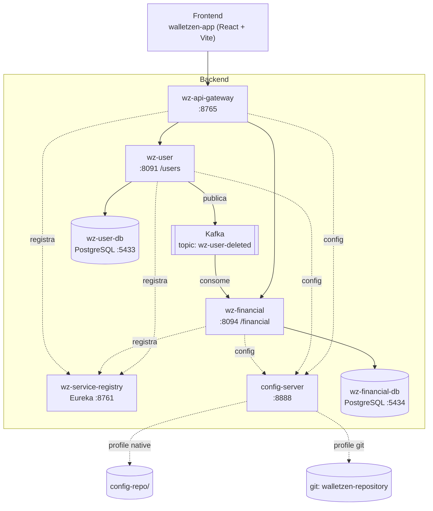

# WalletZen — Backend

Backend da aplicação **WalletZen** (gestão de finanças pessoais), construído como
estudo de arquitetura de microsserviços com Spring Cloud.

O usuário cadastra pessoas (`wz-user`) e lança transações financeiras de
receita/despesa para cada pessoa (`wz-financial`). Os dois serviços conversam de
forma assíncrona por Kafka: ao excluir um usuário, suas transações são desativadas
automaticamente.

> **Status:** projeto de estudo, sem release. Não há camada de
> autenticação/autorização. Os bancos sobem com `ddl-auto: create-drop`
> (dados voláteis a cada restart). O frontend fica no repositório
> [`walletzen-app`](https://github.com/Ismadrade/walletzen-app) e ainda não está
> integrado a estas APIs.

---

## Sumário

- [Arquitetura](#arquitetura)
- [Stack](#stack)
- [Serviços](#serviços)
- [Comunicação assíncrona (Kafka)](#comunicação-assíncrona-kafka)
- [Bancos de dados](#bancos-de-dados)
- [APIs](#apis)
- [Modelos de dados](#modelos-de-dados)
- [Como rodar localmente](#como-rodar-localmente)
- [Variáveis de ambiente](#variáveis-de-ambiente)
- [Estrutura de pastas](#estrutura-de-pastas)

---

## Arquitetura



Padrões de projeto por serviço:

- **wz-user** — arquitetura hexagonal (ports & adapters): `core` (domínio + casos de
  uso) isolado dos `adapter` de entrada (web) e saída (persistência JPA, Kafka).
- **wz-financial** — arquitetura em camadas tradicional (`controller` → `service` →
  `repository`).

---

## Stack

Java 17 · Spring Boot 3.4.x · Spring Cloud 2024.0.x · Spring Cloud Gateway ·
Netflix Eureka · Spring Cloud Config · Spring Data JPA · PostgreSQL · Apache Kafka
(`spring-kafka`) · Lombok · MapStruct.

**Build:** Maven wrapper (`config-server`, `wz-api-gateway`, `wz-service-registry`,
`wz-user`) e Gradle wrapper (`wz-financial`).

**Configuração externa:** `wz-user`, `wz-financial` e `wz-api-gateway` consomem o
`config-server` no boot (`spring.config.import: optional:configserver:...`). O
`application.yml` local de cada serviço tem só a identidade (`spring.application.name`) e
o ponteiro para o config-server; datasource, Kafka e Eureka vêm de fora.

O `config-server` tem dois backends, escolhidos por profile:

| Profile | Backend | Origem | Quando usar |
| ------- | ------- | ------ | ----------- |
| `native` (**default**) | arquivos locais | `config-server/config-repo/` | Desenvolvimento; não precisa de rede nem credenciais. |
| `git` | Spring Cloud Config + Git | repo **`walletzen-repository`** (`search-paths` `wz-user-repo*`, `wz-financial-repo*`, branch `main`) | Cenário "remoto"; exige `GIT_USERNAME`/`GIT_PASSWORD`. |

Ative o backend Git com `SPRING_PROFILES_ACTIVE=git`. Cada serviço aceita
`CONFIG_SERVER_URL` (default `http://localhost:8888`); como o import é `optional:`, o
serviço ainda sobe se o config-server estiver fora do ar (com a config local/default).

---

## Serviços

| Serviço              | Porta | Context path | Build  | Responsabilidade |
| -------------------- | ----- | ------------ | ------ | ---------------- |
| `wz-service-registry`| 8761  | —            | Maven  | Service discovery (Eureka Server). Não se registra nem busca registro. |
| `config-server`      | 8888  | —            | Maven  | Spring Cloud Config Server. Backend `native` (default, lê de `config-repo/`) ou `git` (`walletzen-repository`, com `SPRING_PROFILES_ACTIVE=git`). Consumido por `wz-user`, `wz-financial` e `wz-api-gateway`. |
| `wz-api-gateway`     | 8765  | —            | Maven  | Spring Cloud Gateway. Roteia `/users/**` → `lb://wz-user` e `/financial/**` → `lb://wz-financial`. Discovery locator habilitado. |
| `wz-user`            | 8091  | `/users`     | Maven  | CRUD de usuários. Publica evento `UserDeleted` no Kafka ao excluir. Arquitetura hexagonal. |
| `wz-financial`       | 8094  | `/financial` | Gradle | CRUD de transações financeiras. Consome `UserDeleted` e desativa as transações do usuário. |

---

## Comunicação assíncrona (Kafka)

- **Tópico:** `wz-user-deleted` (criado por `wz-user` com 3 partições, 1 réplica).
- **Produtor:** `wz-user` → ao chamar `DELETE /users/{id}`, o usuário sofre
  *soft delete* (`recordStatus = false`) e um `UserDeletedEvent`
  (`{ "userId": "<uuid>" }`) é publicado.
- **Consumidor:** `wz-financial` (`group-id: wz-financial-group`,
  `auto-offset-reset: earliest`) recebe o evento e executa
  `UPDATE Transaction SET recordStatus = false WHERE userId = :userId`.
- Serialização das mensagens: JSON como `String` (Jackson), sem schema registry.
- Infra local: `obsidiandynamics/kafka` + **Redpanda Console** em
  `http://localhost:8081` para inspecionar tópicos.

---

## Bancos de dados

| Banco               | Imagem            | Porta host | Usado por      |
| ------------------- | ----------------- | ---------- | -------------- |
| `wz-user-db`        | `postgres:latest` | 5433       | `wz-user`      |
| `wz-financial-db`   | `postgres:latest` | 5434       | `wz-financial` |

Credenciais padrão: `postgres` / `postgres`. `spring.jpa.hibernate.ddl-auto` =
`create-drop` nos dois serviços — o schema é recriado a cada inicialização.

---

## APIs

Chamada direta ao serviço usa o context path próprio; via gateway, use o host
`:8765` com o mesmo caminho.

### wz-user — base `http://localhost:8091/users` (ou `http://localhost:8765/users`)

| Método | Caminho        | Descrição |
| ------ | -------------- | --------- |
| GET    | `/`            | Lista usuários paginada. Query params: `page` (0), `size` (10), `sort` (`name`), `direction` (`ASC`). Retorna `PageInfo<UserResponse>`. |
| GET    | `/{userId}`    | Busca usuário por `UUID`. |
| POST   | `/`            | Cria usuário. Body `UserRequest`. `201 Created`. Valida e-mail e CPF únicos. |
| PUT    | `/{userId}`    | Edita `name`, `email` e `birthDate`. |
| DELETE | `/{userId}`    | *Soft delete* + publica evento Kafka. |

### wz-financial — base `http://localhost:8094/financial/transactions` (ou `http://localhost:8765/financial/transactions`)

| Método | Caminho            | Descrição |
| ------ | ------------------ | --------- |
| GET    | `/user/{userId}`   | Lista paginada das transações ativas do usuário. Query params: `page` (0), `size` (10, máx. 100), `year`, `month` (1-12, exige `year`). Ordena por `createdAt` desc. Retorna `PageResponseDTO<TransactionResponseDTO>` (mesmo formato do `PageInfo` do `wz-user`). Filtro `year`/`month` recai sobre `createdAt`. |
| GET    | `/{id}`            | Busca transação ativa por `UUID`. |
| POST   | `/`                | Cria transação. Body `TransactionRequestDTO` (validado: `userId`/`amount` obrigatórios, `amount` positivo, `transactionType` não vazio). `201 Created`. |
| PUT    | `/{id}`            | Atualiza `transactionType`, `amount`, `description`. |
| DELETE | `/{id}`            | *Soft delete* (`204 No Content`). |

Erros são padronizados por `GlobalExceptionHandler` em ambos os serviços
(`ExceptionResponse` / `UserNotFoundException`, `UserFieldAlreadyExistsException`,
`TransactionNotFoundException`, `InvalidTransactionTypeException`,
`InvalidFilterException`).

---

## Modelos de dados

**User** (`wz-user`, tabela `WZ_USER`)

| Campo         | Tipo            | Notas |
| ------------- | --------------- | ----- |
| `id`          | UUID            | gerado |
| `name`        | String          | obrigatório |
| `cpf`         | String          | obrigatório, único |
| `email`       | String          | obrigatório, único |
| `birthDate`   | LocalDate       | `yyyy-MM-dd` |
| `createdAt` / `updatedAt` | LocalDateTime | automáticos |
| `recordStatus`| boolean         | `true` = ativo (soft delete) |

**Transaction** (`wz-financial`, tabela `WZ_TRANSACTION`)

| Campo            | Tipo                      | Notas |
| ---------------- | ------------------------- | ----- |
| `id`             | UUID                      | gerado |
| `transactionType`| enum `INCOME` / `EXPENSE` | obrigatório |
| `amount`         | BigDecimal(10,2)          | obrigatório |
| `description`    | String                    | opcional |
| `userId`         | UUID                      | obrigatório (referência lógica ao `wz-user`) |
| `createdAt` / `updatedAt` | LocalDateTime    | automáticos |
| `recordStatus`   | boolean                   | `true` = ativo (soft delete) |

---

## Como rodar localmente

### Pré-requisitos

Docker + Docker Compose · JDK 17.

### 1. Infraestrutura (bancos + Kafka)

```bash
docker compose up -d
```

Sobe: `wz-user-db` (5433), `wz-financial-db` (5434), `kafka` (9092 / 2181) e
`redpanda-console` (8081).

### 2. Microsserviços

Suba nesta ordem. Cada serviço tem seu wrapper na respectiva pasta.

```bash
# 1. Service registry (Eureka)
cd wz-service-registry && ./mvnw spring-boot:run

# 2. Config server  (profile 'native' por default — lê de config-server/config-repo/.
#    Para o backend Git: SPRING_PROFILES_ACTIVE=git + GIT_USERNAME/GIT_PASSWORD)
cd config-server && ./mvnw spring-boot:run

# 3. API Gateway
cd wz-api-gateway && ./mvnw spring-boot:run

# 4. wz-user
cd wz-user && ./mvnw spring-boot:run

# 5. wz-financial (Gradle)
cd wz-financial && ./gradlew bootRun
```

No Windows use `mvnw.cmd` / `gradlew.bat`.

Confira que os serviços leram do config-server:

```bash
curl http://localhost:8888/wz-user/default        # config servida
# no log de cada serviço: "Fetching config from server at : http://localhost:8888"
```

- Eureka dashboard: `http://localhost:8761`
- Gateway: `http://localhost:8765`

---

## Variáveis de ambiente

| Variável       | Serviço        | Padrão            | Descrição |
| -------------- | -------------- | ----------------- | --------- |
| `SPRING_PROFILES_ACTIVE` | `config-server` | `native` | `native` lê de `config-repo/`; `git` usa o repositório `walletzen-repository` |
| `GIT_USERNAME` | `config-server`| —                 | Usuário do repositório Git de configuração (só no profile `git`) |
| `GIT_PASSWORD` | `config-server`| —                 | Senha / token do repositório Git de configuração (só no profile `git`) |
| `CONFIG_SERVER_URL` | `wz-user`, `wz-financial`, `wz-api-gateway` | `http://localhost:8888` | Endereço do config-server |
| `DB_HOST`      | `wz-user`, `wz-financial` | `localhost` | Host do PostgreSQL |
| `DB_PORT`      | `wz-user` / `wz-financial` | `5433` / `5434` | Porta do PostgreSQL |
| `DB_NAME`      | `wz-user` / `wz-financial` | `wz-user-db` / `wz-financial-db` | Nome do banco |
| `DB_USER`      | `wz-user`, `wz-financial` | `postgres` | Usuário do banco |
| `DB_PASSWORD`  | `wz-user`, `wz-financial` | `postgres` | Senha do banco |
| `KAFKA_BROKER` | `wz-user`, `wz-financial` | `localhost:9092` | Bootstrap server do Kafka |

---

## Estrutura de pastas

```
Backend/
├── docker-compose.yml       # postgres x2, kafka, redpanda-console
├── config-server/           # Spring Cloud Config  (:8888)
│   └── config-repo/         # configs servidas no profile 'native' (application.yml, wz-*.yml)
├── wz-service-registry/     # Eureka Server         (:8761)
├── wz-api-gateway/          # Spring Cloud Gateway  (:8765)
├── wz-user/                 # microsserviço de usuários   (:8091, hexagonal)
│   └── src/main/java/br/com/walletzen/
│       ├── core/            # domínio + casos de uso (ports)
│       ├── adapter/inbound/web/       # REST controller + DTOs
│       └── adapter/outbound/          # JPA + Kafka publisher
└── wz-financial/            # microsserviço financeiro    (:8094, camadas)
    └── src/main/java/br/com/walletzen/
        ├── controller/ service/ repository/ domain/
        └── consumer/       # UserDeletedConsumer (Kafka)
```
