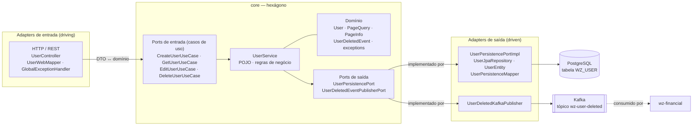
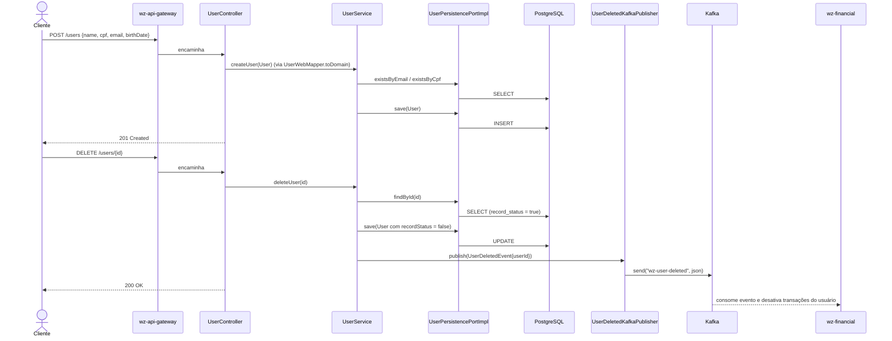

# wz-user

Microsserviço de **gestão de usuários** do WalletZen. É o serviço de referência de
**arquitetura hexagonal (ports & adapters)** do backend: o núcleo de domínio e os
casos de uso ficam isolados de qualquer framework, e o mundo externo (HTTP,
PostgreSQL, Kafka) entra e sai apenas por portas.

- **Porta HTTP:** `8091` · **context-path:** `/users`
- **Via gateway:** `http://localhost:8765/users/**` (`wz-api-gateway` → `lb://wz-user`)
- **Registro:** Eureka em `http://localhost:8761/eureka`
- **Evento publicado:** tópico Kafka `wz-user-deleted` (consumido por `wz-financial`)

---

## Sumário

- [Arquitetura hexagonal](#arquitetura-hexagonal)
  - [Diagrama](#diagrama)
  - [Camadas e componentes](#camadas-e-componentes)
  - [Direção das dependências](#direção-das-dependências)
  - [Fluxos ponta a ponta](#fluxos-ponta-a-ponta)
- [Endpoints](#endpoints)
- [Tratamento de erros](#tratamento-de-erros)
- [Modelo de dados](#modelo-de-dados)
- [Dependências para rodar](#dependências-para-rodar)
  - [Ferramentas](#ferramentas)
  - [Infraestrutura (Docker)](#infraestrutura-docker)
  - [Serviços Spring Cloud](#serviços-spring-cloud)
  - [Dependências Maven](#dependências-maven)
  - [Variáveis de ambiente](#variáveis-de-ambiente)
- [Como rodar localmente](#como-rodar-localmente)
- [Testes](#testes)

---

## Arquitetura hexagonal

O código está organizado em dois blocos: `core` (dentro do hexágono) e `adapter`
(fora dele). O `core` define **portas** — interfaces — e nunca conhece quem as
implementa. Os `adapter` dependem do `core`, nunca o contrário.

```
br.com.walletzen
├── core                         # hexágono: domínio + aplicação (sem framework)
│   ├── domain                   #   User, PageQuery, PageInfo<T>, event/UserDeletedEvent
│   ├── exception                #   UserNotFoundException, UserFieldAlreadyExistsException
│   ├── port
│   │   ├── input                #   ports de entrada (casos de uso)
│   │   └── output               #   ports de saída (persistência, mensageria)
│   └── service                  #   UserService — implementa os casos de uso
├── adapter
│   ├── inbound
│   │   └── web                  # adapter de ENTRADA (driving): REST
│   │       ├── UserController
│   │       ├── dto              #   UserRequest, UserResponse
│   │       ├── mapper           #   UserWebMapper (MapStruct)
│   │       └── handler          #   GlobalExceptionHandler, ExceptionResponse
│   └── outbound
│       ├── persistence          # adapter de SAÍDA (driven): PostgreSQL / JPA
│       │   ├── UserPersistencePortImpl
│       │   ├── UserJpaRepository
│       │   ├── entities/UserEntity
│       │   └── mapper/UserPersistenceMapper (MapStruct)
│       └── kafka                # adapter de SAÍDA (driven): mensageria
│           └── UserDeletedKafkaPublisher
├── config                       # BeanConfiguration, KafkaConfig
└── WzUserApplication
```

### Diagrama



O hexágono só fala com o exterior através de `IN` (portas de entrada) e `OUT`
(portas de saída). Trocar REST por gRPC, ou PostgreSQL por outro banco, é escrever
um novo adapter — o `core` não muda.

### Camadas e componentes

| Camada | Componente | Papel |
| --- | --- | --- |
| **Domínio** | `User` | Entidade de domínio (POJO puro, sem JPA). Guarda `id`, `name`, `cpf`, `email`, `birthDate`, `recordStatus`. |
| | `PageQuery` | Parâmetros de paginação que entram no núcleo (`page`, `size`, `sort`, `direction`). |
| | `PageInfo<T>` | Resultado paginado devolvido pelo núcleo (`content`, `pageNumber`, `pageSize`, `totalElements`, `totalPages`, `last`). |
| | `event.UserDeletedEvent` | Evento de domínio emitido ao excluir um usuário (carrega `userId`). |
| | `UserNotFoundException`, `UserFieldAlreadyExistsException` | Erros de negócio. |
| **Ports de entrada** | `CreateUserUseCase`, `GetUserUseCase`, `EditUserUseCase`, `DeleteUserUseCase` | Contratos dos casos de uso; é o que o adapter web enxerga. |
| **Aplicação** | `UserService` | Implementa os quatro casos de uso. Orquestra validações e persistência **usando apenas as portas de saída**. É um POJO — instanciado por `BeanConfiguration`, sem `@Service`. |
| **Ports de saída** | `UserPersistencePort` | Abstrai a persistência: `findAll`, `findById`, `save`, `existsByEmail`, `existsByCpf`, `existsById`. |
| | `UserDeletedEventPublisherPort` | Abstrai a publicação do evento de exclusão. |
| **Adapter de entrada** | `UserController` (`@RestController`) | Traduz HTTP em chamadas de caso de uso. |
| | `UserWebMapper` (MapStruct) | `UserRequest` → `User` e `User` → `UserResponse`. |
| | `GlobalExceptionHandler` (`@RestControllerAdvice`) | Converte exceções em `ExceptionResponse` + status HTTP. |
| **Adapter de saída** | `UserPersistencePortImpl` (`@Component`) | Implementa `UserPersistencePort` sobre Spring Data JPA; monta `Pageable`/`Sort`. |
| | `UserJpaRepository` | `JpaRepository<UserEntity, UUID>`; queries só trazem registros com `recordStatus = true`. |
| | `UserEntity` (`@Entity`, tabela `WZ_USER`) | Mapeamento JPA; `@PrePersist` seta `createdAt`/`updatedAt`/`recordStatus`. |
| | `UserPersistenceMapper` (MapStruct) | `UserEntity` ↔ `User`. |
| | `UserDeletedKafkaPublisher` (`@Component`) | Implementa `UserDeletedEventPublisherPort`; serializa o evento com Jackson e envia via `KafkaTemplate`. |
| **Configuração** | `BeanConfiguration` | Constrói o bean `UserService` injetando as duas portas de saída. |
| | `KafkaConfig` | `ProducerFactory`/`KafkaTemplate` (serialização String) e criação do tópico `wz-user-deleted` (3 partições, 1 réplica). |

### Direção das dependências

```
adapter.inbound.web  ─▶  core.port.input   ◀─  core.service  ─▶  core.port.output  ◀─  adapter.outbound.*
                              │                     │                    │
                              └─────────────  core.domain  ──────────────┘
```

- Tudo aponta para dentro: os adapters dependem do `core`; o `core` não importa
  nada de `adapter` nem do Spring Web/Data/Kafka.
- A injeção acontece na borda: o Spring descobre os `@Component` de saída e o
  `BeanConfiguration` os entrega ao `UserService`.

### Fluxos ponta a ponta



- **Criar / editar** exercitam só a porta de persistência.
- **Excluir** é *soft delete*: marca `recordStatus = false` e **depois** publica o
  evento na porta de mensageria. A falha ao publicar é apenas logada
  (`UserDeletedKafkaPublisher`), não desfaz o delete.

---

## Endpoints

Caminhos relativos ao context-path `/users`. Via gateway, prefixe com
`http://localhost:8765`.

| Método | Caminho | Descrição | Sucesso |
| --- | --- | --- | --- |
| `GET` | `/users` | Lista paginada de usuários **ativos**. | `200` `PageInfo<UserResponse>` |
| `GET` | `/users/{userId}` | Busca um usuário ativo por `UUID`. | `200` `UserResponse` |
| `POST` | `/users` | Cadastra um usuário. | `201` (sem corpo) |
| `PUT` | `/users/{userId}` | Atualiza `name`, `email` e `birthDate` do usuário. | `200` (sem corpo) |
| `DELETE` | `/users/{userId}` | *Soft delete* + publicação do evento `UserDeletedEvent`. | `200` (sem corpo) |

### `GET /users`

Retorna apenas registros com `recordStatus = true` (`findAllActiveUsers`).

Query params:

| Param | Default | Observação |
| --- | --- | --- |
| `page` | `0` | Índice da página (base 0). |
| `size` | `10` | Itens por página. |
| `sort` | `name` | Campo de ordenação (`name`, `email`, `birthDate`, ...). |
| `direction` | `ASC` | `ASC` ou `DESC`. |

Resposta:

```json
{
  "content": [
    { "id": "…", "name": "…", "cpf": "…", "email": "…", "birthDate": "1993-09-09" }
  ],
  "pageNumber": 0,
  "pageSize": 10,
  "totalElements": 2,
  "totalPages": 1,
  "last": true
}
```

### `GET /users/{userId}`

`userId` é um `UUID`. Só encontra usuários ativos. Inexistente ou inativo → `404`.

### `POST /users`

Corpo (`UserRequest`):

```json
{ "name": "Ana Lima", "cpf": "12345678901", "email": "ana@exemplo.com", "birthDate": "1990-04-12" }
```

- `birthDate` no formato `yyyy-MM-dd`.
- `email` e `cpf` são únicos; duplicidade → `400` `UserFieldAlreadyExistsException`.
- Sem validação de formato de CPF/e-mail (projeto de estudo).

### `PUT /users/{userId}`

Mesmo corpo do `POST`. **Atualiza apenas `name`, `email` e `birthDate`** — o `cpf`
enviado é ignorado. Se o `email` mudar para um já usado por outro usuário → `400`.
Usuário inexistente → `404`.

### `DELETE /users/{userId}`

Não remove a linha: seta `recordStatus = false`, persiste e publica
`{"userId":"<uuid>"}` no tópico `wz-user-deleted`. O `wz-financial` consome e
desativa as transações daquele usuário. Usuário inexistente → `404`.

---

## Tratamento de erros

`GlobalExceptionHandler` (`@RestControllerAdvice`) devolve sempre um
`ExceptionResponse`:

```json
{ "date": "2026-08-27 14:30:00", "message": "User not found with ID: …" }
```

| Exceção | Status | Quando |
| --- | --- | --- |
| `UserNotFoundException` | `404 Not Found` | ID não existe ou registro inativo. |
| `UserFieldAlreadyExistsException` | `400 Bad Request` | `email` ou `cpf` já cadastrado. |
| `Exception` (genérica) | `500 Internal Server Error` | Qualquer outra falha. |

---

## Modelo de dados

Tabela `WZ_USER` (PostgreSQL). Com `ddl-auto: create-drop`, é recriada a cada boot;
`import.sql` insere dois usuários de exemplo.

| Coluna | Tipo | Notas |
| --- | --- | --- |
| `ID` | `UUID` | PK, gerada pela aplicação (`@UuidGenerator`). |
| `NAME` | `varchar` | Not null. |
| `CPF` | `varchar` | Not null, **único**. |
| `EMAIL` | `varchar` | Not null, **único**. |
| `BIRTH_DATE` | `date` | Opcional. |
| `CREATED_AT` | `timestamp` | Not null, imutável (`@PrePersist`). |
| `UPDATED_AT` | `timestamp` | Atualizada em `@PreUpdate`. |
| `RECORD_STATUS` | `boolean` | `true` = ativo; `false` = excluído (*soft delete*). |

---

## Dependências para rodar

### Ferramentas

| Item | Versão | Observação |
| --- | --- | --- |
| **JDK** | 17 | `java.version` no `pom.xml`. |
| **Maven** | 3.9+ | Há wrapper local (`./mvnw`), mas `.mvn/`, `mvnw`, `mvnw.cmd` estão no `.gitignore` — num clone limpo use um Maven instalado ou rode pela IDE. |
| **Docker + Docker Compose** | — | Para subir PostgreSQL e Kafka. |
| **Lombok / MapStruct** | — | Processadores de anotação; habilite o *annotation processing* na IDE. |

### Infraestrutura (Docker)

`docker-compose.yml` na **raiz do `Backend/`** sobe o que o `wz-user` precisa:

| Serviço | Porta (host) | Uso pelo wz-user |
| --- | --- | --- |
| `wz-user-db` (PostgreSQL) | `5433` → 5432 | Banco `wz-user-db`, usuário/senha `postgres`/`postgres`. |
| `kafka` (`obsidiandynamics/kafka`) | `9092` (+ `2181` ZooKeeper) | Broker para o tópico `wz-user-deleted`. |
| `redpanda-console` | `8081` | Opcional — UI para inspecionar o tópico. |

```bash
docker compose up -d wz-user-db kafka
```

### Serviços Spring Cloud

Não são obrigatórios para subir o `wz-user` isolado (ele apenas tentará se
registrar no Eureka em segundo plano), mas o fluxo completo do sistema precisa:

| Serviço | Porta | Papel |
| --- | --- | --- |
| `wz-service-registry` (Eureka) | `8761` | Descoberta; o `wz-user` se registra aqui. |
| `wz-api-gateway` | `8765` | Roteia `/users/**` → `lb://wz-user`. |
| `wz-financial` | `8094` | Consumidor do evento `wz-user-deleted`. |
| `config-server` | `8888` | Existe, mas **não é consumido** (`spring-cloud-starter-config` comentado no `pom.xml`). |

### Dependências Maven

Herda de `spring-boot-starter-parent` **3.4.5**. Principais artefatos
(`pom.xml`):

| Dependência | Versão | Para quê |
| --- | --- | --- |
| `spring-boot-starter-web` | (BOM) | REST / Tomcat embarcado. |
| `spring-boot-starter-data-jpa` | (BOM) | Persistência (Hibernate). |
| `spring-cloud-starter-netflix-eureka-client` | 4.2.1 | Registro no Eureka. |
| `org.postgresql:postgresql` | (BOM, `runtime`) | Driver JDBC. |
| `org.springframework.kafka:spring-kafka` | 3.3.5 | Producer do evento de exclusão. |
| `org.mapstruct:mapstruct` (+ `mapstruct-processor`) | 1.6.3 | Mappers DTO/entity ↔ domínio. |
| `org.projectlombok:lombok` | 1.18.36 (`provided`) | Boilerplate na `UserEntity` e no publisher. |
| `spring-security-crypto` | 6.4.4 | Utilitários de cripto (disponível para hashing). |
| `com.google.guava:guava` | 32.0.1-android | Utilidades. |
| `com.thoughtworks.xstream:xstream` | 1.4.21 | Serialização XML (transitiva de uso interno). |
| `org.apache.httpcomponents:httpclient` | 4.5.13 | Cliente HTTP. |
| `commons-io:commons-io` | 2.14.0 | Utilidades de IO. |
| `spring-boot-starter-test` | (BOM, `test`) | JUnit 5, Mockito, MockMvc. |
| `spring-kafka-test` | 3.3.5 (`test`) | Broker embarcado para testes. |

### Variáveis de ambiente

Todas têm default para rodar tudo em `localhost` (ver `application.yml`):

| Variável | Default | Descrição |
| --- | --- | --- |
| `DB_HOST` | `localhost` | Host do PostgreSQL. |
| `DB_PORT` | `5433` | Porta do PostgreSQL. |
| `DB_NAME` | `wz-user-db` | Nome do banco. |
| `DB_USER` | `postgres` | Usuário. |
| `DB_PASSWORD` | `postgres` | Senha. |
| `KAFKA_BROKER` | `localhost:9092` | `bootstrap-servers` do Kafka. |

Valores fixos no `application.yml`: `server.port=8091`, `context-path=/users`,
`eureka…defaultZone=http://localhost:8761/eureka`,
`spring.kafka.topic.wz-user-deleted=wz-user-deleted`,
`spring.jpa.hibernate.ddl-auto=create-drop`.

---

## Como rodar localmente

```bash
# 1. Infra (a partir da raiz do Backend/)
docker compose up -d wz-user-db kafka

# 2. (opcional, para o fluxo completo) registry e gateway
#    rode wz-service-registry e wz-api-gateway pelos seus próprios módulos

# 3. wz-user (a partir de Backend/wz-user)
./mvnw spring-boot:run
#    ou, sem wrapper:
mvn spring-boot:run
```

Testes rápidos:

```bash
curl http://localhost:8091/users
curl -X POST http://localhost:8091/users \
  -H "Content-Type: application/json" \
  -d '{"name":"Ana Lima","cpf":"12345678901","email":"ana@exemplo.com","birthDate":"1990-04-12"}'
```

---

## Testes

```bash
./mvnw test
```

- `UserControllerTest` — `@WebMvcTest` do `UserController` + `UserWebMapperImpl`,
  com `UserService` mockado (`@MockitoBean`). Cobre listagem, busca por ID e o
  `404` de usuário inexistente.
- `UserServiceTest` — testes de unidade das regras de negócio do `UserService`
  com as portas de saída mockadas.
